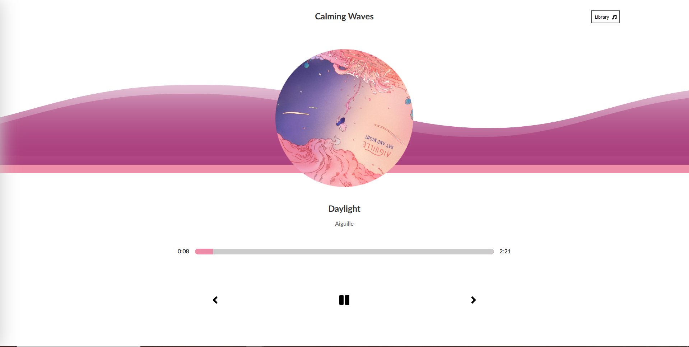

# Calming Waves [Demo](https://joaquimgi.github.io/waves-music-app/)

Music Player made with React JS, SASS and some CSS animation. This player was made following a course from Dev Ed but with some tweaks from me to remove redundant code and a nice wave animation and a spinning album cover.

<a href="https://joaquimgi.github.io/waves-music-app/">

</a>

## Main tech used to complete this project

- React.js
- Sass
- Css animations
- Media queries for mobile responsive

### Installation

1- Clone this repo  
2- Install the dependencies and devDependencies and start the application.

#### Using NPM

```sh
$ cd waves-music-app
$ npm install
$ npm run start
```
